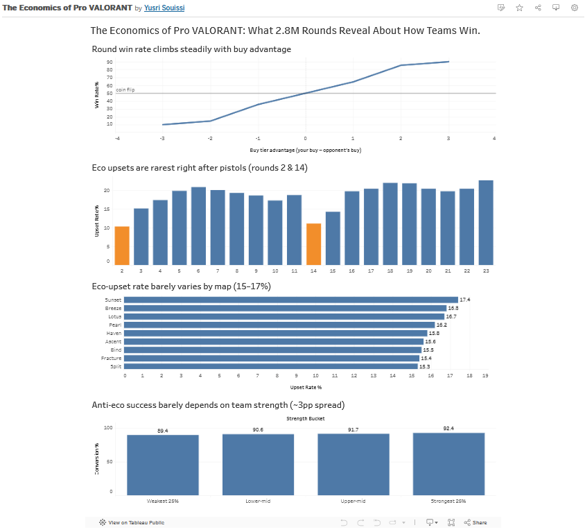

# The Economics of Pro VALORANT

An analysis of ~2.2 million rounds from professional VALORANT (VCT) matches,
examining how in-game economy drives round and map outcomes.

**[View the interactive Tableau dashboard →](https://public.tableau.com/views/TheEconomicsofProVALORANT/Dashboard1?:language=en-US&:sid=&:redirect=auth&:display_count=n&:origin=viz_share_link)**

## Overview

Round economy is one of the deepest strategic layers in VALORANT, but it's rarely
quantified. Starting from a raw dataset of ~129,000 professional match maps, I
reverse-engineered the encoded round-by-round economy data, validated the parser
against official scoreboards (500 maps, zero mismatches), and analyzed how buying
decisions shape who wins.

## Key Findings

- **Buy advantage is decisive.** A logistic regression showed each tier of buy
  advantage multiplies a team's odds of winning a round by ~2.1x. Win rate climbs
  from ~10% (heavy eco) to ~90% (full buy vs. broke opponent).
- **Anti-ecos are the most reliable spot in the game.** Eco upsets happen ~19% of the
  time normally, but only 10.7% right after pistol rounds.
- **The map barely matters.** Eco-upset rates vary just 15–17% across all maps —
  round timing matters far more than map geometry.
- **Neither does skill, much.** Anti-eco conversion rises only ~3 points from the
  weakest to strongest teams; these rounds are won by the situation, not the players.
- **Momentum is real and economic.** The team that wins a round wins the next 61.6%
  of the time, and winning a pistol round translates to a map win ~63.5% of the time
  (consistent across both halves).

The unifying theme: **early economic advantages compound.**

## Methods & Rigor

- Reverse-engineered and validated the encoded round-breakdown format against scoreboards.
- Caught and corrected a team-labeling bias (even-buy rounds showed 52.7% instead of 50%)
  by symmetrizing across both teams' perspectives.
- Used honest, zero-based axes for small-effect charts to avoid overstating differences.

## Tools

- **Python** (pandas, statsmodels, matplotlib) — parsing, analysis, regression
- **SQL** (SQLite) — reproduced findings + window functions and CTEs (`valorant_economy_analysis.sql`)
- **Tableau** — interactive dashboard

## Files

- `VCT_Project.ipynb` — full analysis notebook
- `valorant_economy_analysis.sql` — SQL query showcase
- `dashboard.png` — dashboard preview

## Data & Limitations

Analysis covers professional (VCT) play, so findings describe high-level competition
and may not generalize to ranked ladder play. Buy "tier" is a coarse proxy for exact
credits spent. [Add a note here on where the dataset came from.]

---

*Analysis by Yusri Souissi*
